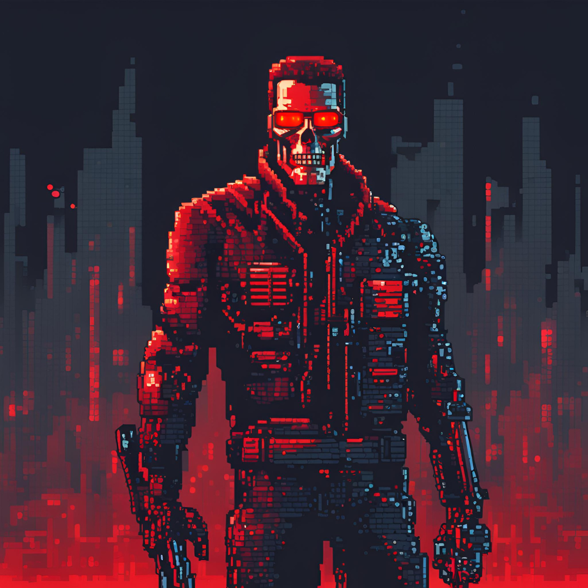

    

-------

# Projeto EBOOK Gerado por I.A.s

* 📍 Ebook desenvolvido para o Bootcamp do Santander sobre IA, pela plataforma da  [DIO](https://dio.me) e através dos ensinamentos do instrutor [Felipe Aguiar](https://github.com/felipeAguiarCode) 

Projeto com o objetivo de gerar um ebook digital com as facilidades das ferramentas de IA. todos os prompts seguem abaixo.
<a href="https://github.com/4ndradeGabriel/dio-project-prompts-to-create-a-ebook/blob/main/output/ebook%20-%20javascript%20terminator.pdf" title="View PDF now"> 📕CLIQUE AQUI PARA LER</a>

## 💻 Tecnologias utilizadas no projeto

- [ChatGPT](https://chat.openai.com/) 
- [Canva](https://www.canva.com/)
- [PowerPoint](https://www.microsoft.com/en/microsoft-365/powerpoint)

## 🧠 Prompts

ChatGPT：

|   Ação   | prompt                                                                                                                                                                                                                                                                         |
| :------: | ------------------------------------------------------------------------------------------------------------------------------------------------------------------------------------------------------------------------------------------------------------------------------ |
|  Título  | Crie um título de um ebook sobre o tema de Javascript para front-end, o ebook é do nicho de programação e o subnicho é de javascript, o título deve ser épico e curto, e tenha uma temática de exterminador do futuro no título, me liste 5 variações de títulos                                                        |
| Conteúdo | Faça um texto para ebook , com foco em Javascript, focado em Desenvolvimento Front-end: como o javascript pode ajudar na construção de interfaces web listando os principais assuntos, e com exemplos em código. {REGRAS} Explique sempre de uma maneira simples Deixe o texto enxuto Sempre traga exemplos de código em contextos reais Sempre deixe um título sugestivo por tópico|

Canva：

|  Ação  | prompt                                                                                 |
| :----: | -------------------------------------------------------------------------------------- |
| Imagens | A terminator walking with his shotgun, one of his eyes is glowing in red, pixel art style |
| Imagens | terminator universe, destroyed city in fire, pixel art style |

## ✨ Features

- Conteúdo gerado via ChatGPT
- Imagens geradas via Canva
- Diagramação feita via Microsoft PowerPoint

## 📚 Materiais

- Imagens utilizadas em `assets`
- ebook gerado durante as aulas em `output`

## 🛠️ Instruções de execução

Utilize os prompts acima nas ferramentas sugeridas para gerar o material base e utilize uma ferramenta de edição de documentos como power point, libreoffice , indesign para diagramação.

## 👨‍💻 Autor

Gabriel Andrade  
[GitHub](https://github.com/4ndradeGabriel)  
[LinkedIn](https://www.linkedin.com/in/andradegabrielw)  

---

Desenvolvido por [Gabriel Andrade](https://github.com/4ndradeGabriel)
